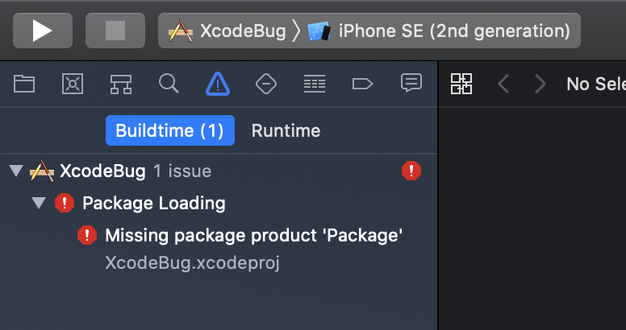

# swiftpm-xcode-bug
Xcode SwiftPM integration bug with "Missing package product"

## Steps to reproduce

1. Open `XcodeBug.xcodeproj` in the `master` branch, build and run, all will succeed.
2. Without closing Xcode, check out `test-branch` and try to build.
3. You'll see this:

The only work around that helps with this bug is to completely close Xcode and reopen the project. This also causes all SwiftPM dependencies to be re-resolved in the project, which can take some time if you have multiple dependencies.
